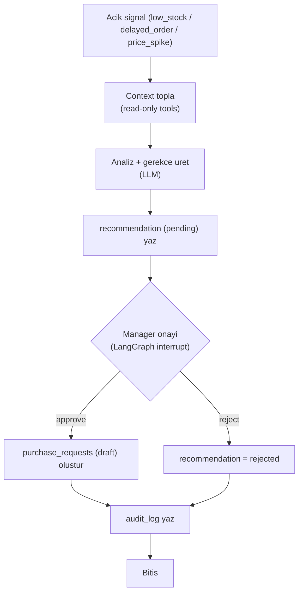

# ProcureFlow — Agent Tasarımı

Agent, LangGraph ile kurulan **insan onaylı** bir karar destek akışıdır. Görevi:
açık bir sinyali (düşük stok / geciken sipariş / fiyat artışı) inceleyip
gerekçeli bir satın alma önerisi hazırlamak ve yönetici onayına sunmaktır.

> Kritik kısıt: **Agent hiçbir zaman satın alma işlemini tamamlamaz.** Onay
> alındığında yalnızca bir **taslak satın alma talebi** (`purchase_requests`,
> `status='draft'`) oluşturur.

---

## 1. Yüksek Seviye Akış



---

## 2. Grafik Düğümleri (LangGraph)

1. **gather_context** — Sinyalin tipine göre ilgili verileri araçlarla toplar.
2. **analyze** — LLM ile durumu değerlendirir; önerilen tedarikçi, miktar ve
   *gerekçe* metnini üretir. Miktar için `reorder_qty` ve mevcut stok temel
   alınır; LLM serbest sayı uydurmaz, kural + bağlamla sınırlandırılır.
3. **write_recommendation** — `recommendations` tablosuna `pending` kayıt yazar.
4. **approval_gate (interrupt)** — Akış burada durur; durum checkpointer'da
   saklanır. Yönetici kararı web'den gelince devam eder.
5. **create_draft_request** — Onayda `purchase_requests (draft)` oluşturur.
6. **finalize** — Sonucu `audit_log`'a yazar, sinyali `handled` yapar.

State (Pydantic model) alanları örneği: `signal`, `context`, `analysis`,
`recommendation_id`, `decision`, `run_id`.

---

## 3. Araçlar (Tools) — Hepsi Read-Only

| Tool | Amaç |
| --- | --- |
| `get_product(product_id)` | Ürün detayı, min stok, reorder qty |
| `get_stock(product_id)` | Lokasyon bazlı güncel stok |
| `get_open_orders(product_id?)` | Açık siparişler, beklenen teslim tarihleri |
| `get_supplier_prices(product_id)` | Tedarikçi fiyat geçmişi/karşılaştırma |
| `get_supplier_info(supplier_id)` | Tedarikçi lead time, aktiflik |

- Araçlar yalnızca okuma yapar; hiçbiri yazma/silme içermez.
- Yazma işlemleri (öneri, taslak talep) grafik düğümleri içinde, kısıtlı agent
  kimliğiyle ve kontrollü şekilde yapılır — LLM'in doğrudan çağırabileceği bir
  "satın al" aracı **yoktur**.

---

## 4. LLM Soyutlaması (Sağlayıcı-Bağımsız)

Tek bir fabrika fonksiyonu tüm modeli sağlar:

```python
# apps/api/agent/llm.py (taslak)
def get_chat_model():
    provider = settings.LLM_PROVIDER  # "ollama" | "openai" | "anthropic" | "groq"
    if provider == "ollama":
        return ChatOllama(model=settings.LLM_MODEL, base_url=settings.OLLAMA_URL)
    if provider == "openai":
        return ChatOpenAI(model=settings.LLM_MODEL, api_key=settings.OPENAI_API_KEY)
    # ... diger saglayicilar
```

- **Başlangıç:** `LLM_PROVIDER=ollama` (ör. `llama3.1` / `qwen2.5`), lokal
  `docker-compose` ile ücretsiz geliştirme.
- **Geçiş:** `.env`'de `LLM_PROVIDER` ve `LLM_MODEL` değiştirilir; kod aynı
  kalır (ör. `gpt-4o-mini`, Claude Haiku, Groq, DeepSeek gibi ucuz modeller).
- Tüm sağlayıcılar LangChain `BaseChatModel` arayüzünü paylaştığı için grafik
  değişmez.

İlgili env değişkenleri:

```env
LLM_PROVIDER=ollama
LLM_MODEL=llama3.1
OLLAMA_URL=http://ollama:11434
# hosted gecerken:
# LLM_PROVIDER=openai
# LLM_MODEL=gpt-4o-mini
# OPENAI_API_KEY=...
```

---

## 5. Onay Kapısı ve Kalıcılık

- **Interrupt + checkpointer:** LangGraph'in Postgres checkpointer'ı akış
  durumunu saklar. `approval_gate` düğümünde akış `interrupt` ile durur.
- Yönetici web'den `approve`/`reject` gönderince API, aynı `run_id` ile akışı
  kaldığı yerden devam ettirir.
- Bu sayede agent bir kararı beklerken sunucu yeniden başlasa bile durum
  kaybolmaz.

---

## 6. Güvenlik ve Güvence

- Agent'ın DB kimliği kısıtlı: `purchase_orders` yazamaz; yalnızca
  `recommendations` ve `purchase_requests (draft)`.
- Öneri miktarı ve tedarikçi seçimi kurallarla sınırlandırılır; LLM sadece
  gerekçe ve kural içi tercih üretir.
- Her düğüm sonucu `audit_log`'a `actor_type='agent'` ile yazılır.
- Prompt injection'a karşı: araç çıktıları yapılandırılmış (Pydantic) döner,
  serbest metin komutları model tarafından "yetki" olarak yorumlanamaz.

---

## 7. Test Yaklaşımı

- **Birim:** her tool ayrı test edilir (DB fixture ile).
- **Grafik:** LLM mock'lanarak düğüm geçişleri ve interrupt/devam davranışı
  test edilir (pytest).
- **Senaryo:** her sinyal tipi için "sinyal → öneri → onay → taslak talep"
  uçtan uca test (Playwright ile web tarafı dahil).
