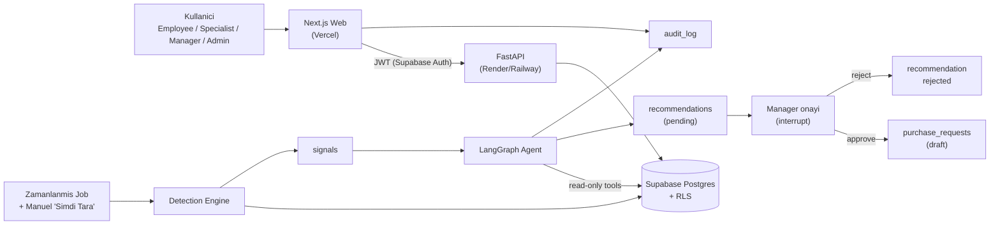
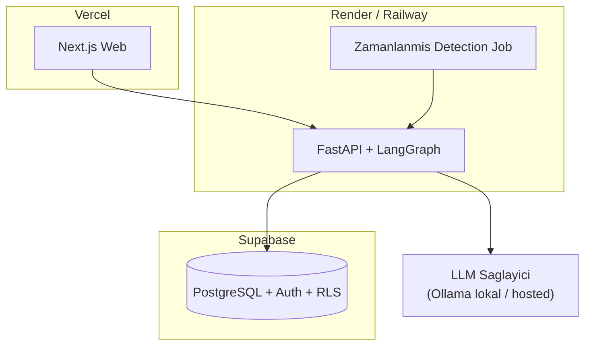

# ProcureFlow — Mimari

> Agentic Procurement & Inventory Operations. Bir işletmenin stok ve satın alma
> süreçlerini yöneten, düşük stok / geciken sipariş / olağan dışı fiyat artışı
> tespit eden ve **insan onaylı** satın alma önerileri üreten ERP modülü.

Bu doküman sistemin genel mimarisini, bileşenlerini ve aralarındaki veri akışını
anlatır. Detaylar için:

- Veri modeli: [DATA_MODEL.md](./DATA_MODEL.md)
- Agent tasarımı: [AGENT.md](./AGENT.md)
- Yol haritası: [ROADMAP.md](./ROADMAP.md)

---

## 1. Temel İlkeler

1. **Agent asla satın alma tamamlamaz.** Agent yalnızca *okur* ve *gerekçeli
   öneri* üretir. Onaylanan öneri yalnızca **taslak satın alma talebine**
   (`purchase_requests`, status = `draft`) dönüşür. Gerçek sipariş açma, insan
   kararı ve ayrı bir süreçtir.
2. **Human-in-the-loop.** Onay adımı LangGraph akışında bir kesme (interrupt)
   noktasıdır; yönetici onaylamadan akış ilerlemez.
3. **Her şey audit'lenir.** Hem kullanıcı hem agent işlemleri `audit_log`'a
   `actor_type` (`user` | `agent`) ile yazılır.
4. **En az yetki (least privilege).** Agent'ın kendi kısıtlı servis kimliği
   vardır: read-only araçlar + yalnızca `recommendations` ve `purchase_requests`
   (draft) yazma yetkisi.
5. **Sağlayıcı-bağımsız LLM.** Başta açık kaynak (Ollama), sonra tek bir env
   değişikliğiyle ucuz hosted modele geçiş.

---

## 2. Teknoloji Yığını

| Katman | Teknoloji |
| --- | --- |
| Frontend | Next.js, TypeScript, Tailwind CSS, shadcn/ui |
| Backend | Python, FastAPI, Pydantic |
| Agent orchestration | LangGraph |
| Database | Supabase PostgreSQL |
| Auth | Supabase Auth (JWT) |
| Authorization | RBAC (`profiles.role`) + Row Level Security (RLS) |
| Test | Pytest, Vitest, Playwright |
| Container | Docker, docker-compose (lokal Ollama + api) |
| Deployment | Vercel (web), Render/Railway (api), Supabase (DB/Auth) |

---

## 3. Monorepo Yapısı

```text
ProcureFlow/
  apps/
    web/          # Next.js + TS + Tailwind + shadcn/ui (dashboard)
    api/          # FastAPI + Pydantic + LangGraph (agent + detection)
  supabase/       # migrations, RLS policies, seed data
  docs/           # ARCHITECTURE.md, DATA_MODEL.md, AGENT.md, ROADMAP.md
  docker/         # Dockerfile(ler), docker-compose (lokal geliştirme)
  .github/        # CI workflows (lint + test)
```

Sınır: `apps/web` yalnızca `apps/api`'ye HTTP ile konuşur; DB'ye doğrudan yazma
işlemleri API üzerinden geçer (RLS ile birlikte ikinci savunma hattı). Okuma
tarafında bazı görünümler doğrudan Supabase client + RLS ile de okunabilir.

---

## 4. Sistem Bileşenleri ve Veri Akışı



### Akışın özeti

1. **Detection** — Zamanlanmış job veya kullanıcının manuel "Şimdi Tara"
   isteği kuralları çalıştırır ve `signals` üretir (idempotent).
2. **Agent** — Açık bir sinyal için LangGraph akışı tetiklenir; read-only
   araçlarla bağlam toplar, LLM ile analiz eder ve `pending` bir öneri yazar.
3. **Onay** — Akış onay kesmesinde (interrupt) bekler. Yönetici web'den
   onaylar/reddeder.
4. **Taslak talep** — Onay durumunda agent bir `purchase_requests` (draft)
   oluşturur. Reddedilirse öneri `rejected` olur.
5. **Audit** — Tüm adımlar `audit_log`'a yazılır.

---

## 5. Katmanlar

### 5.1 Web (apps/web)

- Next.js App Router, TypeScript, Tailwind, shadcn/ui.
- Ana ekranlar: Dashboard (sinyaller + öneriler), Ürünler, Stok, Siparişler,
  Tedarikçiler, Öneri detay/onay, Audit log.
- Supabase Auth ile oturum; rol bilgisi `profiles.role`'dan.

### 5.2 API (apps/api)

- FastAPI + Pydantic; katmanlar: `routers/`, `services/`, `agent/`,
  `detection/`, `db/`, `core/` (config, auth, deps).
- JWT doğrulama (Supabase public key), rol bazlı bağımlılıklar (dependencies).
- Detection ve agent iş mantığı burada.

### 5.3 Database (supabase)

- PostgreSQL şeması, RLS politikaları, seed verisi ve migration'lar.
- LangGraph checkpointer için Postgres tablosu (agent durumunun kalıcılığı).

---

## 6. Güvenlik Modeli (özet)

- **Kimlik doğrulama:** Supabase Auth (JWT). API her istekte token doğrular.
- **Yetkilendirme:** İki katman:
  1. **RBAC** — API endpoint'leri `profiles.role`'a göre kısıtlanır.
  2. **RLS** — Postgres seviyesinde satır bazlı erişim; API by-pass edilse bile
     veriye erişim kısıtlı kalır.
- **Agent kimliği:** Ayrı, kısıtlı bir DB rolü. Yazma yetkisi yalnızca
  `recommendations` ve `purchase_requests (draft)`. `purchase_orders` üzerinde
  yazma yetkisi **yok**.
- Detaylı rol tablosu: [DATA_MODEL.md](./DATA_MODEL.md#roller-ve-rls).

---

## 7. Deployment Topolojisi



- Lokal geliştirmede LLM için `docker-compose` içinde Ollama çalışır.
- Production'da `LLM_PROVIDER` env'i ucuz hosted modele çevrilir (aynı arayüz).
