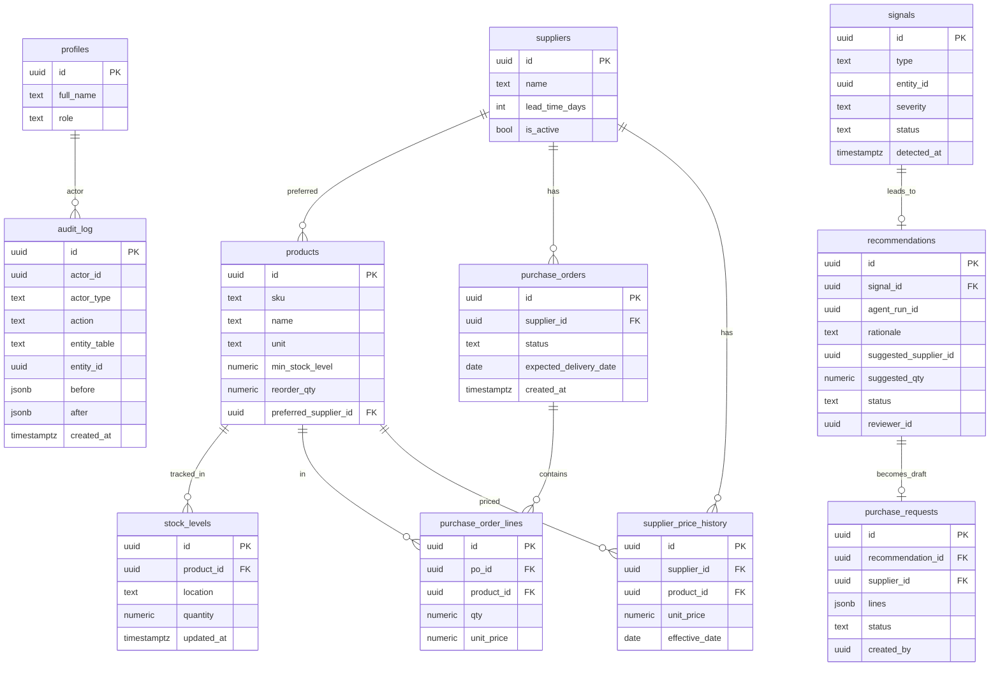

# ProcureFlow — Veri Modeli

Bu doküman çekirdek tabloları, ilişkilerini, roller ve RLS yaklaşımını anlatır.
Şema Supabase PostgreSQL üzerinde kurulacak; migration'lar `supabase/` altında
tutulacak.

---

## 1. Varlık İlişki Diyagramı

---

## 2. Tablolar

### profiles
Supabase `auth.users` ile 1-1. Uygulama içi kullanıcı profili ve rolü.
- `id` (uuid, PK, `auth.users.id` FK)
- `full_name` (text)
- `role` (text/enum): `employee | procurement_specialist | manager | admin | system_agent`

### suppliers
Tedarikçiler.
- `id`, `name`, `contact_email`, `lead_time_days` (int), `is_active` (bool)

### products
Ürün kataloğu ve yeniden sipariş parametreleri.
- `id`, `sku` (unique), `name`, `unit` (adet/kg/lt...)
- `min_stock_level` (numeric) — düşük stok eşiği
- `reorder_qty` (numeric) — önerilecek varsayılan sipariş miktarı
- `preferred_supplier_id` (uuid, FK → suppliers)

### stock_levels
Ürün başına lokasyon bazlı stok.
- `id`, `product_id` (FK), `location`, `quantity` (numeric), `updated_at`

### purchase_orders
Açık/kapalı satın alma siparişleri (gecikme tespiti için).
- `id`, `supplier_id` (FK), `status`: `open | received | cancelled`
- `expected_delivery_date` (date), `created_at`

### purchase_order_lines
Sipariş satırları.
- `id`, `po_id` (FK), `product_id` (FK), `qty`, `unit_price`

### supplier_price_history
Tedarikçi-ürün fiyat geçmişi (fiyat artışı tespiti için).
- `id`, `supplier_id` (FK), `product_id` (FK), `unit_price`, `effective_date`

### signals
Detection engine çıktısı.
- `id`, `type`: `low_stock | delayed_order | price_spike`
- `entity_id` (ilgili product/po/supplier), `severity`: `low | medium | high`
- `status`: `open | handled`, `detected_at`
- Idempotency için `(type, entity_id, status=open)` benzersizliği hedeflenir.

### recommendations
Agent'ın gerekçeli önerisi.
- `id`, `signal_id` (FK), `agent_run_id` (LangGraph çalışma kimliği)
- `rationale` (text) — LLM'in gerekçesi
- `suggested_supplier_id`, `suggested_qty`
- `status`: `pending | approved | rejected`
- `reviewer_id` (onaylayan/reddeden yönetici)

### purchase_requests
Onaylanan öneriden üreyen **taslak** talep. Gerçek sipariş değildir.
- `id`, `recommendation_id` (FK), `supplier_id`
- `lines` (jsonb) — draft satırlar
- `status`: `draft` (ilk sürümde sadece draft)
- `created_by`: `system_agent`

### audit_log
Kullanıcı ve agent işlemleri.
- `id`, `actor_id`, `actor_type`: `user | agent`
- `action` (ör. `signal.created`, `recommendation.approved`)
- `entity_table`, `entity_id`, `before` (jsonb), `after` (jsonb), `created_at`

---

## 3. Roller ve RLS

| Rol | Yetki özeti |
| --- | --- |
| **Employee** | Ürün/stok görüntüleme, düşük stok bildirme |
| **Procurement Specialist** | Tedarikçi/sipariş yönetimi, önerileri inceleme |
| **Manager** | Önerileri onayla/reddet, taslak talep üretimini tetikle |
| **Admin** | Kullanıcı/rol yönetimi, tüm görünüm |
| **System Agent** | Read-only araçlar + `recommendations`/`purchase_requests (draft)` yazma |

### RLS yaklaşımı

- Her tabloda RLS **açık**. Politikalar `auth.uid()` ve `profiles.role`
  üzerinden kurulur.
- Okuma: kimliği doğrulanmış kullanıcılar rollerine uygun satırları görür
  (ör. audit_log yalnızca manager/admin).
- Yazma: kritik tablolar (`purchase_orders`) yalnızca specialist/manager/admin.
- **Agent rolü**, `purchase_orders` üzerinde INSERT/UPDATE yapamaz; yalnızca
  `recommendations` ve `purchase_requests (status='draft')` insert edebilir.
- `audit_log` her yazma yolunda (API service + DB trigger) doldurulur; kimse
  update/delete edemez (append-only).

---

## 4. Notlar

- Enum'lar başta Postgres `enum` yerine `text + check` ile başlayıp gerekirse
  enum'a taşınabilir (migration esnekliği için).
- Zaman damgaları `timestamptz`; tüm hesaplar UTC.
- Idempotent detection için sinyal üretiminde açık sinyal varsa tekrar
  oluşturulmaz, `detected_at` güncellenir veya severity yükseltilir.
